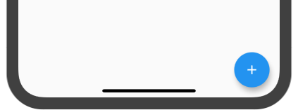
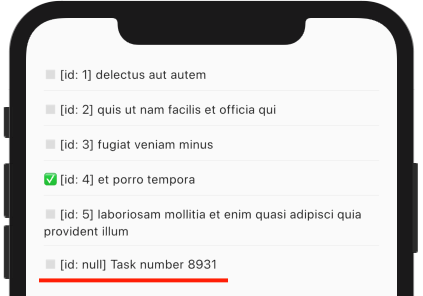
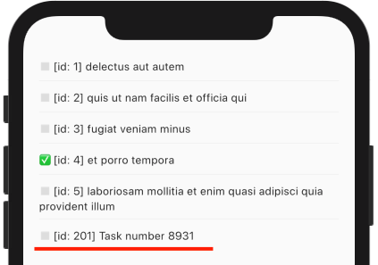

In a `FloatingActionButton` callback, we instantiate a new `Todo` model with a totally random title and save it:

```dart {hl_lines=[3]}
floatingActionButton: FloatingActionButton(
  onPressed: () {
    Todo(title: "Task number ${Random().nextInt(9999)}").save();
  },
  child: Icon(Icons.add),
),
```

(This goes in our app's `Scaffold`!)



Done!

Clicking that button sends a request in the background to `POST https://my-json-server.typicode.com/flutterdata/demo/todos`

But... why can't we see this new `Todo` in the list?!

### ⚡️ Reactivity to the rescue

It's not there because we used a `FutureBuilder` which fetches the list just **once**.

The solution is making the list reactive – in other words, using `watchAll()`. Instead of returning a `Future`, it returns a specific [`StateNotifier`](https://pub.dev/packages/state_notifier):

```dart {hl_lines=[5 6 7 8 13 17]}
class TodoScreen extends StatelessWidget {
  @override
  Widget build(BuildContext context) {
    final repository = context.watch<Repository<Todo>>();
    return DataStateBuilder<List<Todo>>(
      notifier: () => repository.watchAll(params: {'userId': '1', '_limit': '5'}),
      builder: (context, state, notifier, _) {
        if (state.isLoading) {
          return Center(child: const CircularProgressIndicator());
        }
        return ListView.separated(
          itemBuilder: (context, i) {
            final todo = state.model[i];
            return Text(
                '${todo.completed ? "✅" : "◻️"} [id: ${todo.id}] ${todo.title}');
          },
          itemCount: state.model.length,
          separatorBuilder: (context, i) => Divider(),
          padding: EdgeInsets.symmetric(vertical: 50, horizontal: 20),
        );
      },
    );
  }
}
```

What went on here?

We are using `DataStateBuilder` (pretty much like a `ValueListenableBuilder`) to access [`DataState`](https://pub.dev/packages/data_state) objects. They give us:

- loading state (`state.isLoading`)
- error state (`state.hasException` and `state.exception`)
- data state (`state.model`)

Add [flutter_data_state](https://pub.dev/packages/flutter_data_state) to your `pubspec.yaml` to install and **restart** the app!

Creating a new TO-DO _will_ now show up:

Before, with an `id=null` (temporary model which hasn't been persisted):



After, with an `id=201` that was assigned by the API server:



Notice that we passed a `_limit=5` query param, so we only got 5 items!

The new `Todo` appeared because `watchAll()` reflects the current **local storage** state. (As a matter of fact, JSON Placeholder does not actually persist anything!)

Models are fetched from the network _in the background_ by default. This strategy can be changed by overriding methods in a [custom adapter](/repository/adapters).

### ⛲️ Prefer a Stream API?

No problem. If you don't like `DataState` or `StateNotifier` you can totally bypass them and use good ol' streams:

```dart {hl_lines=[5 6 7 8 13 17]}
class TodoScreen extends StatelessWidget {
  @override
  Widget build(BuildContext context) {
    final repository = context.watch<Repository<Todo>>();
    return StreamBuilder<List<Todo>>(
      stream: repository.watchAll(params: {'userId': '1', '_limit': '5'}).stream,
      builder: (context, snapshot) {
        if (!snapshot.hasData) {
          return Center(child: const CircularProgressIndicator());
        }
        return ListView.separated(
          itemBuilder: (context, i) {
            final todo = snapshot.data[i];
            return Text(
                '${todo.completed ? "✅" : "◻️"} [id: ${todo.id}] ${todo.title}');
          },
          itemCount: snapshot.data.length,
          separatorBuilder: (context, i) => Divider(),
          padding: EdgeInsets.symmetric(vertical: 50, horizontal: 20),
        );
      },
    );
  }
}
```

Just call `watchAll().stream`.

**Check out the app's full source code: https://github.com/flutterdata/flutter_data_todos**
