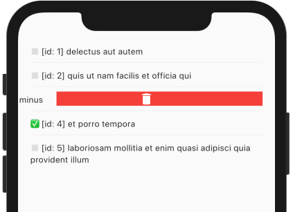
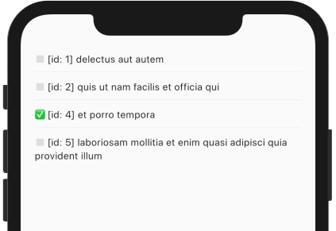

There's stuff "User 1" just doesn't want to do!

We can delete a `Todo` on dismiss by wrapping the text with a `Dismissible` and calling `todo.delete()`:

```dart {hl_lines=["13-25"]}
class TodoList extends StatelessWidget {
  final DataState<List<Todo>> state;
  const TodoList(this.state, {Key key}) : super(key: key);

  @override
  Widget build(BuildContext context) {
    if (state.isLoading) {
      return Center(child: const CircularProgressIndicator());
    }
    return ListView.separated(
      itemBuilder: (context, i) {
        final todo = state.model[i];
        return Dismissible(
          child: Text(
              '${todo.completed ? "✅" : "◻️"} [id: ${todo.id}] ${todo.title}'),
          key: ValueKey(todo),
          direction: DismissDirection.endToStart,
          background: Container(
            color: Colors.red,
            child: Icon(Icons.delete, color: Colors.white),
          ),
          onDismissed: (_) async {
            await todo.delete();
          },
        );
      },
      itemCount: state.model.length,
      separatorBuilder: (context, i) => Divider(),
      padding: EdgeInsets.symmetric(vertical: 50, horizontal: 20),
    );
  }
}
```

Hot-reload and swipe left...



Done! (well, not really "done" 😄)


