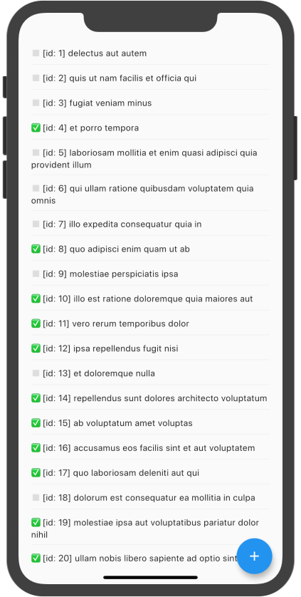
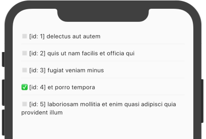

ADD INTRO AND EMBED YOUTUBE VIDEO

Now that Flutter Data is ready to use, we have access to our `Repository<Task>` via Provider's `context.watch`.


**Important:** Make sure you went through the **[quickstart](/docs/quickstart)** to get everything set up!


It's a REST client with CRUD actions that has a `findAll` method. We can start by displaying [JSON Placeholder](https://my-json-server.typicode.com/flutterdata/demo/) `User id=1`'s list of TO-DOs:

```dart {hl_lines=[4 6]}
class TaskScreen extends StatelessWidget {
  @override
  Widget build(BuildContext context) {
    final repository = context.watch<Repository<Task>>();
    return FutureBuilder<List<Task>>(
      future: repository.findAll(params: {'userId': '1'}),
      builder: (context, snapshot) {
        if (!snapshot.hasData) {
          return Center(child: const CircularProgressIndicator());
        }
        return ListView.separated(
          itemBuilder: (context, i) {
            final task = snapshot.data[i];
            return Text(
                '${task.completed ? "✅" : "◻️"} [id: ${task.id}] ${task.title}');
          },
          itemCount: snapshot.data.length,
          separatorBuilder: (context, i) => Divider(),
          padding: EdgeInsets.symmetric(vertical: 50, horizontal: 20),
        );
      },
    );
  }
}
```

and call it from `TaskApp`:

```dart {hl_lines=[5]}
builder: (context) {
  if (context.watch<DataManager>() == null) {
    return const CircularProgressIndicator();
  }
  return TaskScreen();
},
```

Bam!



**Whoa! Hold on, how did we get that magic to work?**

Well, Flutter Data made an HTTP GET request on `https://my-json-server.typicode.com/flutterdata/demo/tasks?userId=1` because we requested to `findAll` `Task`s for a `User id=1`:

- `https://my-json-server.typicode.com/flutterdata/demo/` was defined as `baseUrl` in the `JSONPlaceholderAdapter` mixin
- `tasks` is the default endpoint for `findAll` which, of course, is [overridable](/repository#findall)
- `userId=1` is the query parameter we supplied

For more information see the [Repository docs](/repository).


Check out the full source code at **https://github.com/flutterdata/tutorial**


### Limit the amount of TO-DO items - OR MAYBE FILTER BY USER FIRST!

Let's make the number of TO-DOs more manageable via the `_limit` query param:

```dart
  future: repository.findAll(params: {'userId': 1, '_limit': 5}),
```

_One hot-reload later..._





#### In case you were wondering...

[Chopper](https://pub.dev/packages/chopper) and [Retrofit](https://pub.dev/packages/retrofit) are REST client generators. Flutter Data is a REST client generator, too, [but goes way beyond](/).

