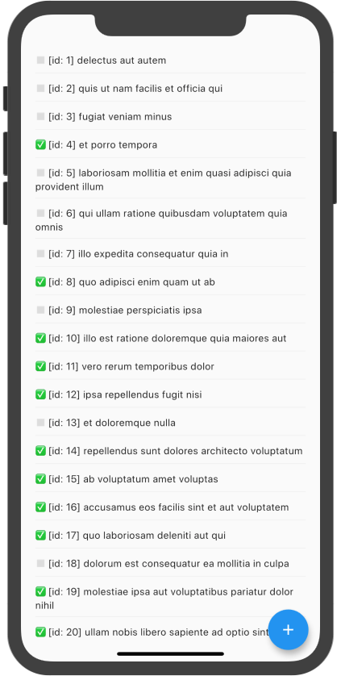

HERE ALSO SHOW MAP/FILTER ON NOTIFIERS (on ad-hoc new providers) AND ALSO BRING SOME OF THE RIVERPOD TODO EXAMPLE FILTERS

Let's now slightly rethink our query. Instead of **"fetching all TO-DOs for user 1"** we are going to **"get user 1 with all their TO-DOs"**.

Flutter Data has great support for [relationships](/data-support/relationships).

First, in `models/user.dart`, we'll create the `User` model:

```dart {hl_lines=[9 10 14]}
import 'package:flutter_data/flutter_data.dart';
import 'package:json_annotation/json_annotation.dart';

import 'todo.dart';

part 'user.g.dart';

@JsonSerializable()
@DataRepository([StandardJSONAdapter, JSONPlaceholderAdapter])
class User with DataModel<User> {
  @override
  final int id;
  final String name;
  final HasMany<Todo> todos;

  User({this.id, this.name, this.todos});
}
```


Notice that `HasMany<Todo>` field: it's a Flutter Data relationship!


But... `User` needs `JSONPlaceholderAdapter`. Since users and TO-DOs share the same base URL (exactly the one defined in `JSONPlaceholderAdapter`) we'll make this adapter **generic**.

Move the existing mixin to its own file at `models/_adapters.dart` and add a type `T extends DataModel`:

```dart {hl_lines=[3]}
import 'package:flutter_data/flutter_data.dart';

mixin JSONPlaceholderAdapter<T extends DataModel<T>> on RemoteAdapter<T> {
  @override
  String get baseUrl => 'http://jsonplaceholder.typicode.com';
}
```

Ready! Now import this file in both `User` and `Todo` models.

Time to run code generation and get a brand-new `Repository<User>`:

```
flutter pub run build_runner build
```

Great. We are now going to request the API, via `watchOne()`, to embed the related `Todo` models:

```dart {hl_lines=[4 5 6 12 13 14 15]}
class TodoScreen extends StatelessWidget {
  @override
  Widget build(BuildContext context) {
    final repository = context.watch<Repository<User>>();
    return DataStateBuilder<User>(
      notifier: () => repository.watchOne('1', params: {'_embed': 'todos'}),
      builder: (context, state, notifier, _) {
        return RefreshIndicator(
          onRefresh: () async {
            await notifier.reload();
          },
          child: TodoList(DataState(
            model: state.model?.todos,
            isLoading: state.isLoading,
          )),
        );
      },
    );
  }
}
```

(With a little `DataState` massaging we can reuse the `TodoList` widget 😄)



Yep, relationships between models are automagically linked!

They work even when data comes in at different times: when new models are loaded, relationships are automatically wired up.


You will notice that double-clicking or swiping left **don't work properly**.

The reason why?

The notifier is listening for new _users_, not _TO-DOs_...

In the next episode, we will see how to make relationships reactive.


If we were to add a `BelongsTo<User>`, this is how our `Todo` would look like:

```dart {hl_lines=[9 10 15]}
import 'package:flutter_data/flutter_data.dart';
import 'package:json_annotation/json_annotation.dart';

import '_adapters.dart';

part 'todo.g.dart';

@JsonSerializable()
@DataRepository([StandardJSONAdapter, JSONPlaceholderAdapter])
class Todo with DataModel<Todo> {
  @override
  final int id;
  final String title;
  final bool completed;
  final BelongsTo<User> user;

  Todo({this.id, this.title, this.completed = false, this.user});
}
```

Great! But remember JSON Placeholder's format:

```json
{
  "userId": 1,
  "id": 1,
  "title": "delectus aut autem",
  "completed": false
}
```

Since `StandardJSONAdapter` identifies relationships in the `user_id` snake-case format (Github API style), we have to override it:

```dart
import 'package:flutter_data/flutter_data.dart';

mixin JSONPlaceholderAdapter<T extends DataModel<T>>
    on StandardJSONAdapter<T> {
  @override
  String get baseUrl => 'http://jsonplaceholder.typicode.com';

  @override
  String get identifierSuffix => 'Id';
}
```

And it works both ways now!


**Check out the source code: https://github.com/flutterdata/tutorial**


