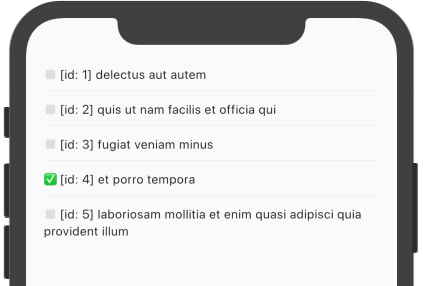

For a minute, let's change that floating action button to _overwrite_ one of our TO-DOs. For example, `Todo` with id=1.

```dart {hl_lines=[3]}
floatingActionButton: FloatingActionButton(
  onPressed: () {
    Todo(id: 1, title: "OVERWRITING TASK!", completed: true).save();
  },
  child: Icon(Icons.add),
),
```

If we hot-reload and click on the `+` button we get:


As discussed before, JSON Placeholder does not persist any data. We'll verify that claim by reloading our data with a `RefreshIndicator` and the very handy `reload()` from `DataStateNotifier`.

First, let's place our list UI in a separate `TodoList` widget:

```dart
class TodoList extends StatelessWidget {
  final DataState<List<Todo>> state;
  const TodoList(this.state, {Key key}) : super(key: key);

  @override
  Widget build(BuildContext context) {
    if (state.isLoading) {
      return Center(child: const CircularProgressIndicator());
    }
    return ListView.separated(
      itemBuilder: (context, i) {
        final todo = state.model[i];
        return Text(
            '${todo.completed ? "✅" : "◻️"} [id: ${todo.id}] ${todo.title}');
      },
      itemCount: state.model.length,
      separatorBuilder: (context, i) => Divider(),
      padding: EdgeInsets.symmetric(vertical: 50, horizontal: 20),
    );
  }
}
```

Next, we simply wrap the new widget and add the `onRefresh` function:

```dart {hl_lines=[8 9 10 11 12 13]}
class TodoScreen extends StatelessWidget {
  @override
  Widget build(BuildContext context) {
    final repository = context.watch<Repository<Todo>>();
    return DataStateBuilder<List<Todo>>(
      notifier: () => repository.watchAll(params: {'userId': '1', '_limit': '5'}),
      builder: (context, state, notifier, _) {
        return RefreshIndicator(
          onRefresh: () async {
            await notifier.reload();
          },
          child: TodoList(state),
        );
      },
    );
  }
}
```

Pull-to-refresh...


And all states have been reset!


