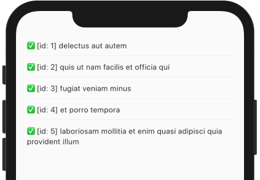

Lastly, we'll add a `GestureDetector` to our list's tiles so we can easily toggle the `completed` state:

```dart {hl_lines=[13 14 15 16]}
class TodoList extends StatelessWidget {
  final DataState<List<Todo>> state;
  const TodoList(this.state, {Key key}) : super(key: key);

  @override
  Widget build(BuildContext context) {
    if (state.isLoading) {
      return Center(child: const CircularProgressIndicator());
    }
    return ListView.separated(
      itemBuilder: (context, i) {
        final todo = state.model[i];
        return GestureDetector(
          onDoubleTap: () {
            Todo(id: todo.id, title: todo.title, completed: !todo.completed).save();
          },
          child: Dismissible(
            child: Text(
                '${todo.completed ? "✅" : "◻️"} [id: ${todo.id}] ${todo.title}'),
            key: ValueKey(todo),
            direction: DismissDirection.endToStart,
            background: Container(
              color: Colors.red,
              child: Icon(Icons.delete, color: Colors.white),
            ),
            onDismissed: (_) async {
              await todo.delete();
            },
          ),
        );
      },
      itemCount: state.model.length,
      separatorBuilder: (context, i) => Divider(),
      padding: EdgeInsets.symmetric(vertical: 50, horizontal: 20),
    );
  }
}
```

Hot-reload and double-click any TO-DO...



All tasks done!
